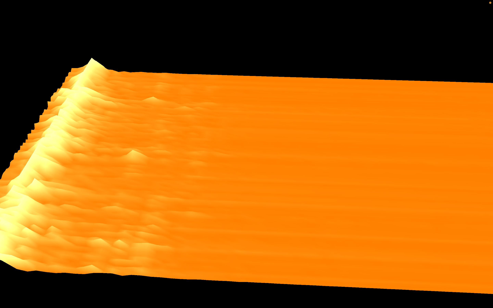

# 3D Audio Spectrum Visualizer

A real-time 3D audio spectrum visualizer built in Python using PyQtGraph and PyQt5.  
Supports live microphone input and MP3 playback with visual feedback.

## Features

- Visualize real-time audio from mic or MP3 file
- see frequency and magnitude
- MP3 playback progress bar (2D overlay)

## Screenshots



## Installation

Make sure you have Python 3.9–3.11 installed.

Install dependencies:

```bash
pip install numpy sounddevice pyqt5 pyqtgraph pydub
